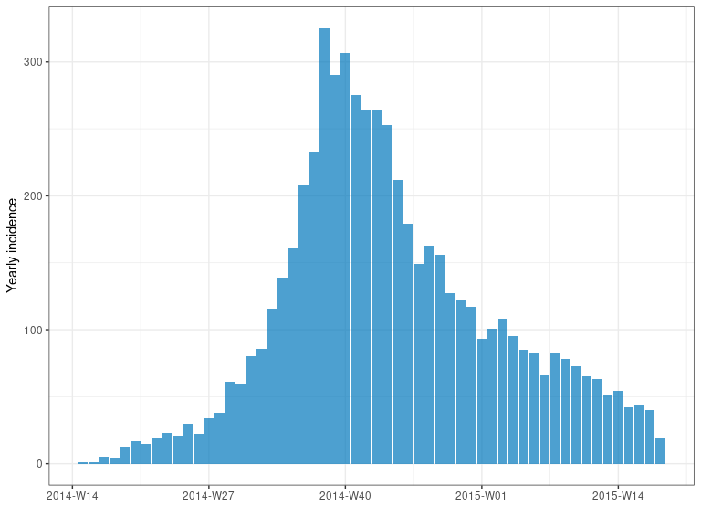
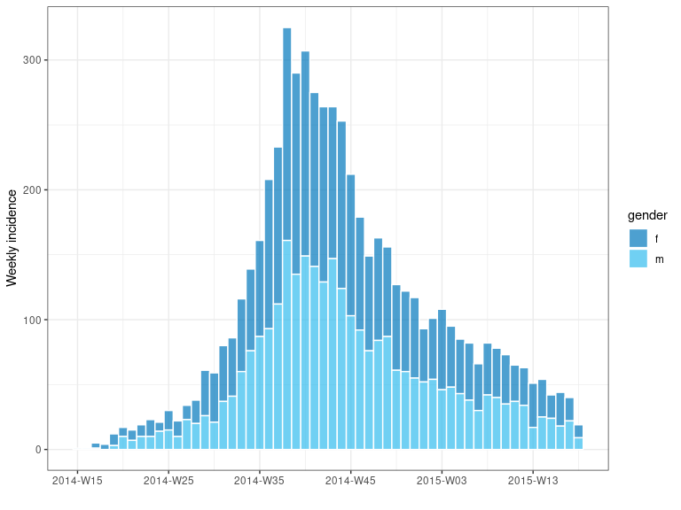
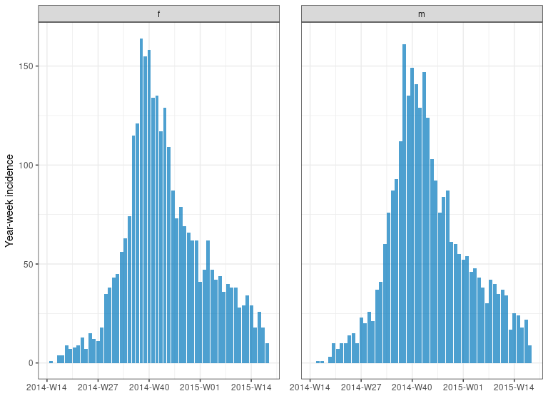
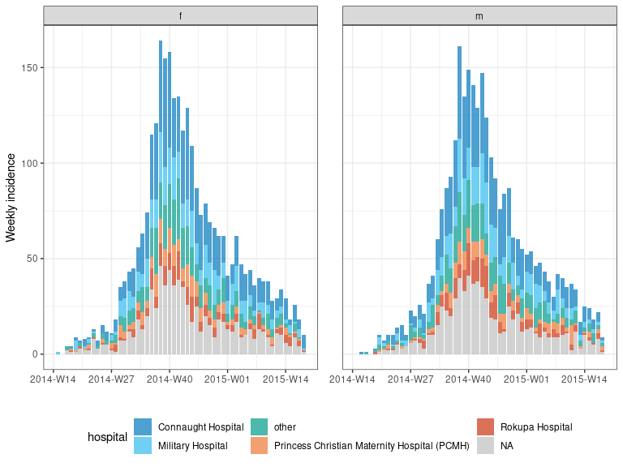

<!-- badges: start -->

[](https://www.repostatus.org/#wip)
[](https://www.tidyverse.org/lifecycle/#experimental)
[](https://CRAN.R-project.org/package=incidence2)
[](https://github.com/reconhub/incidence2/actions)
[](https://codecov.io/gh/reconhub/incidence2?branch=master)
<!-- badges: end -->

<br> **<span style="color: red;">Disclaimer</span>**

This package is a work in progress. Version 0.1.0 has been released to
get feedback from users that we can incorporate in future releases.

# Scope

*incidence2* refocusses the scope of the original
[incidence](https://github.com/reconhub/incidence) package. The aim is
to provide a “tidy” interface for users to work with whilst at the same
time simplifying the underlying implementation. To this end,
*incidence2* concentrates only on the initial data handling, calculation
and graphing of incidence objects. The “fitting” and “peak estimation”
functions of [incidence](https://github.com/reconhub/incidence)
(e.g. `incidence::fit` and `incidence::estimate_peak`) are being
implemented in an accompanying package called
[`incidence2plus`](https://github.com/reconhub/incidence2extra). Here
they will have a more consistent interface, better choice of underlying
models, and tidier outputs.

# What does it do?

The main features of the package include:

  - **`incidence()`**: compute incidence from both linelist and
    pre-aggregated datasets; any fixed time interval can be used; the
    returned object is a tibble subclass called *incidence2*.

  - plotting functions **`plot()`** and **`facet_plot()`**: these
    functions return customised ggplot2 plots of *incidence2* objects
    (see **`plot.incidence2()`** for details).

  - Compatible with [dplyr](https://dplyr.tidyverse.org/) for data
    manipulation. (see `vignette("handling_incidence_objects")` for more
    details).

  - **`regroup()`**: regroup incidence from different groups into one
    global incidence time series.

  - **`cumulate()`**: computes cumulative incidence over time from an
    `incidence()` object.

  - **`print()`** and **`summary()`** functions.

  - Conversion functions:
    
      - **`as.data.frame()`**: converts an `incidence()` object into a
        `data.frame`.
    
      - **`as_tibble()`**: converts an `incidence()` object into a
        `tibble`.

  - Accessor functions: **`get_counts_name()`**, **`get_dates_name()`**,
    **`get_dates()`**, **`get_group_names()`**, **`get_interval()`**,
    **`get_timespan()`** and **`get_n()`**.

# Installing the package

Once it is released on [CRAN](https://CRAN.R-project.org), you will be
able to install the stable version of the package with:

``` r
install.packages("incidence2")
```

The development version can be installed from
[GitHub](https://github.com/) with:

``` r
if (!require(remotes)) {
  install.packages("remotes")
}
remotes::install_github("reconhub/incidence2", build_vignettes = TRUE)
```

# Resources

## Vignettes

A short overview of *incidence2* is provided below in the worked example
below. More detailed tutorials are distributed as vignettes with the
package:

  - `vignette("Introduction", package = "incidence2")`
  - `vignette("handling_incidence_objects", package = "incidence2")`
  - `vignette("customizing_incidence_plots", package = "incidence2")`

## Websites

The following websites are available:

  - The *incidence2* project on *github*, useful for developers,
    contributors, and users wanting to post issues, bug reports and
    feature requests: <br> <https://github.com/reconhub/incidence2>

## Getting help online

Bug reports and feature requests should be posted on *github* using the
[*issue* system](https://github.com/reconhub/incidence2/issues). All
other questions should be posted on the **RECON** slack channel see
<https://www.repidemicsconsortium.org/forum/> for details on how to
join.

# A quick overview

This short example uses the simulated Ebola Virus Disease (EVD) outbreak
from the package [*outbreaks*](https://github.com/reconhub/outbreaks).
It shows how to compute incidence for various time steps plot the
resulting incidence tables.

First, we load the data:

``` r
library(outbreaks)
library(incidence2)

dat <- ebola_sim_clean$linelist
str(dat)
#> 'data.frame':    5829 obs. of  11 variables:
#>  $ case_id                : chr  "d1fafd" "53371b" "f5c3d8" "6c286a" ...
#>  $ generation             : int  0 1 1 2 2 0 3 3 2 3 ...
#>  $ date_of_infection      : Date, format: NA "2014-04-09" ...
#>  $ date_of_onset          : Date, format: "2014-04-07" "2014-04-15" ...
#>  $ date_of_hospitalisation: Date, format: "2014-04-17" "2014-04-20" ...
#>  $ date_of_outcome        : Date, format: "2014-04-19" NA ...
#>  $ outcome                : Factor w/ 2 levels "Death","Recover": NA NA 2 1 2 NA 2 1 2 1 ...
#>  $ gender                 : Factor w/ 2 levels "f","m": 1 2 1 1 1 1 1 1 2 2 ...
#>  $ hospital               : Factor w/ 5 levels "Connaught Hospital",..: 2 1 3 NA 3 NA 1 4 3 5 ...
#>  $ lon                    : num  -13.2 -13.2 -13.2 -13.2 -13.2 ...
#>  $ lat                    : num  8.47 8.46 8.48 8.46 8.45 ...
```

## Computing and plotting incidence

We compute the weekly incidence:

``` r
i_7 <- incidence(dat, date_index = date_of_onset, interval = 7)
i_7
#> An incidence2 object: 56 x 2
#> [5829 cases from days 2014-04-07 to 2015-04-27]
#> [interval: 7 days]
#> [cumulative: FALSE]
#> 
#>    bin_date   count
#>    <date>     <int>
#>  1 2014-04-07     1
#>  2 2014-04-14     1
#>  3 2014-04-21     5
#>  4 2014-04-28     4
#>  5 2014-05-05    12
#>  6 2014-05-12    17
#>  7 2014-05-19    15
#>  8 2014-05-26    19
#>  9 2014-06-02    23
#> 10 2014-06-09    21
#> # … with 46 more rows
summary(i_7)
#> An incidence2 object: 56 x 2
#> 5829 cases from days 2014-04-07 to 2015-04-27
#> interval: 7 days
#> cumulative: FALSE
#> timespan: 386 days
plot(i_7, color = "black")
```



`incidence()` can also compute incidence by specified groups using the
`groups` argument. For instance, we can compute the weekly incidence by
gender and plot in a single, stacked chart:

``` r
i_7_sex <- incidence(dat, interval = "week", 
                     date_index = date_of_onset, groups = gender)
i_7_sex
#> An incidence2 object: 112 x 4
#> [5829 cases from days 2014-04-07 to 2015-04-27]
#> [interval: 1 week]
#> [cumulative: FALSE]
#> 
#>    bin_date   week_group gender count
#>    <date>     <aweek>    <fct>  <int>
#>  1 2014-04-07 2014-W15   f          1
#>  2 2014-04-07 2014-W15   m          0
#>  3 2014-04-14 2014-W16   f          0
#>  4 2014-04-14 2014-W16   m          1
#>  5 2014-04-21 2014-W17   f          4
#>  6 2014-04-21 2014-W17   m          1
#>  7 2014-04-28 2014-W18   f          4
#>  8 2014-04-28 2014-W18   m          0
#>  9 2014-05-05 2014-W19   f          9
#> 10 2014-05-05 2014-W19   m          3
#> # … with 102 more rows
summary(i_7_sex)
#> An incidence2 object: 112 x 4
#> 5829 cases from days 2014-04-07 to 2015-04-27
#> interval: 1 week
#> cumulative: FALSE
#> timespan: 386 days
#> 
#> 1 grouped variable
#> 
#>   gender count
#>   <fct>  <int>
#> 1 f       2934
#> 2 m       2895
plot(i_7_sex, fill = "gender", color = "black")
```



we can facet our plot (grouping detected automatically):

``` r
facet_plot(i_7_sex, n_breaks = 4)
```



and we can also group by multiple variables specifying different facets
and fills:

``` r
# incidence is compatible with the magrittr pipe operator
i_7_sh <- 
  dat %>% 
  incidence(date_index = date_of_onset, interval = "week", 
            groups = c(gender, hospital))
i_7_sh
#> An incidence2 object: 672 x 5
#> [5829 cases from days 2014-04-07 to 2015-04-27]
#> [interval: 1 week]
#> [cumulative: FALSE]
#> 
#>    bin_date   week_group gender hospital                                   count
#>    <date>     <aweek>    <fct>  <fct>                                      <int>
#>  1 2014-04-07 2014-W15   f      Military Hospital                              1
#>  2 2014-04-07 2014-W15   m      Military Hospital                              0
#>  3 2014-04-07 2014-W15   f      Connaught Hospital                             0
#>  4 2014-04-07 2014-W15   m      Connaught Hospital                             0
#>  5 2014-04-07 2014-W15   f      other                                          0
#>  6 2014-04-07 2014-W15   m      other                                          0
#>  7 2014-04-07 2014-W15   f      <NA>                                           0
#>  8 2014-04-07 2014-W15   m      <NA>                                           0
#>  9 2014-04-07 2014-W15   f      Princess Christian Maternity Hospital (PC…     0
#> 10 2014-04-07 2014-W15   m      Princess Christian Maternity Hospital (PC…     0
#> # … with 662 more rows
i_7_sh %>% summary()
#> An incidence2 object: 672 x 5
#> 5829 cases from days 2014-04-07 to 2015-04-27
#> interval: 1 week
#> cumulative: FALSE
#> timespan: 386 days
#> 
#> 2 grouped variables
#> 
#>   gender count
#>   <fct>  <int>
#> 1 f       2934
#> 2 m       2895
#> 
#> 
#>   hospital                                     count
#>   <fct>                                        <int>
#> 1 Connaught Hospital                            1737
#> 2 Military Hospital                              889
#> 3 other                                          876
#> 4 Princess Christian Maternity Hospital (PCMH)   420
#> 5 Rokupa Hospital                                451
#> 6 <NA>                                          1456
i_7_sh %>% facet_plot(facets = gender, fill = hospital)
#> plot() can only stack/dodge by one variable.
#> For multi-facet plotting try facet_plot()
```


