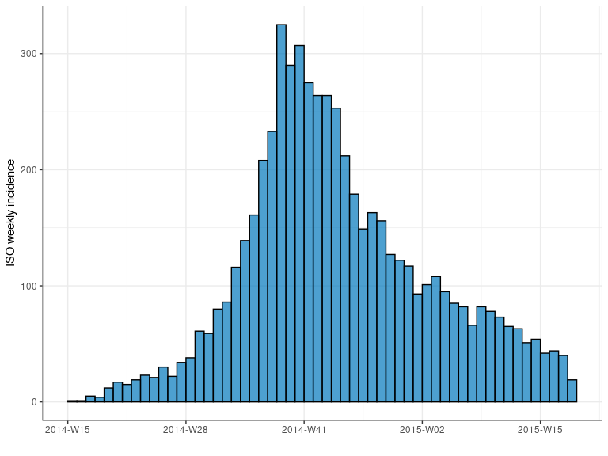
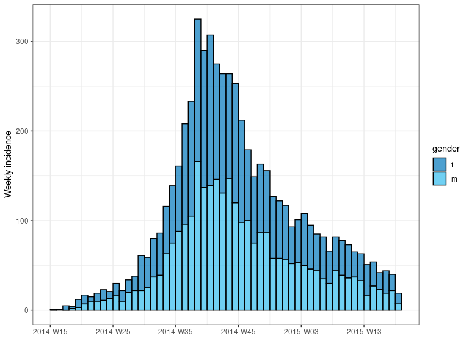
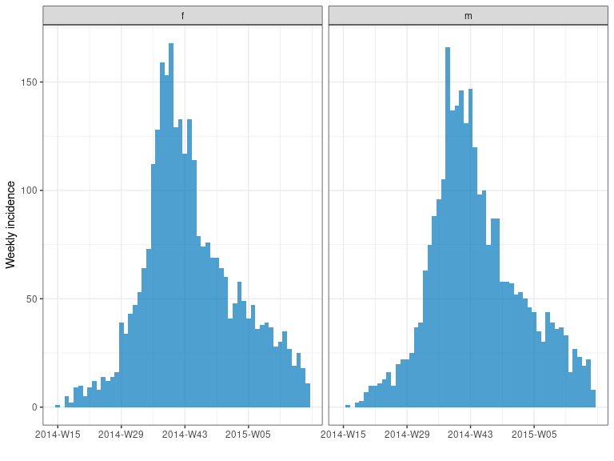
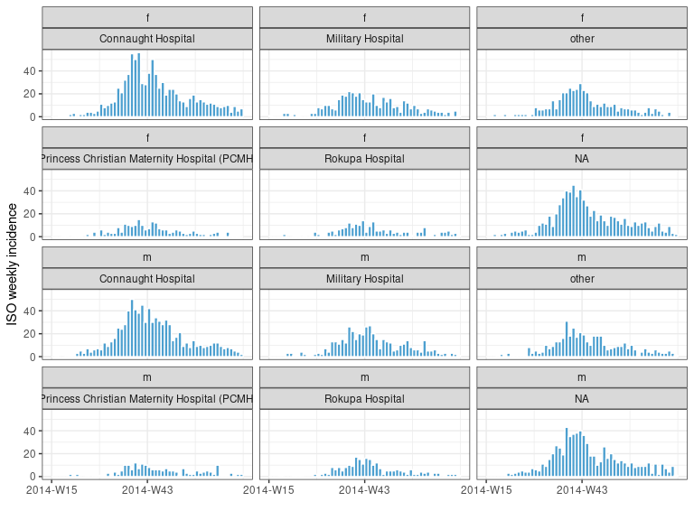

<!-- badges: start -->

[](https://www.repostatus.org/#wip)
[](https://www.tidyverse.org/lifecycle/#experimental)
[](https://CRAN.R-project.org/package=incidence2)
[](https://github.com/reconhub/incidence2/actions)
[](https://codecov.io/gh/reconhub/incidence2)
<!-- badges: end -->

**Disclaimer:** this package is a work in progress. Please reach out to
the authors before using.

# Scope

*incidence2* refocusses the scope of the original
[incidence](https://github.com/reconhub/incidence) package. The aim is
to provide a “tidy” interface for users to work with whilst at the same
time simplifying the underlying implementation. To this end,
*incidence2* concentrates only on the initial data handling, calculation
and graphing of incidence objects. The “fitting” functions of
[incidence](https://github.com/reconhub/incidence)
(e.g. `incidence::fit`) will likely find there place in a smaller,
separate, package with a more consistent interface, more choice of
underlying models, and tidier outputs.

# Installing the package

To install the development, *github* version of the package use:

``` r
devtools::install_github("reconhub/incidence2")
```

# What does it do?

The main features of the package include:

  - **`incidence()`**: compute incidence from linelist datasets; any
    fixed time interval can be used; the returned object is a tibble
    subclass called *incidence*.

  - plotting functions including **`plot_single()`**, **`plot_facet()`**
    and **`plot()`** (a convenience wrapper around `plot_single()`):
    these functions return customised ggplot2 plots of *incidence*
    objects (see `?plot.incidence` for details).

  - Compatible with [dplyr](https://dplyr.tidyverse.org/) for data
    manipulation.

  - **`pool()`**: pool incidence from different groups into one global
    incidence time series.

  - **`cumulate()`**: computes cumulative incidence over time from an
    `incidence` object.

  - **`bootstrap()`**: generates a bootstrapped *incidence()* object by
    re-sampling, with replacement, the original dates of events.

  - **`find_peak()`**: locates the peak time of the epicurve.

  - **`estimate_peak()`**: uses bootstrap to estimate the peak time (and
    related confidence interval) of a partially observed outbreak.

  - **`print()`** and **`summary()`** functions.

  - Conversion functions:
    
      - **`as.data.frame()`**: converts an `incidence()` object into a
        `data.frame`.
    
      - **`as_tibble()`**: convertss an `incidence()` object into a
        `tibble`.

  - Accessor functions: **`get_count_vars()`**, **`get_date_vars()`**,
    **`get_group_vars()`**, **`get_interval()`**, **`get_timespan()`**
    and **`get_n()`**.

# A quick overview

The following worked example provides a brief overview of the package’s
functionalities.

## Loading the data

This example uses the simulated Ebola Virus Disease (EVD) outbreak from
the package [*outbreaks*](https://github.com/reconhub/outbreaks) showing
how to compute incidence for various time steps and manipulate the data.

First, we load the data:

``` r
library(outbreaks)
library(incidence2)
library(dplyr)

dat <- ebola_sim_clean$linelist
glimpse(dat)
#> Rows: 5,829
#> Columns: 11
#> $ case_id                 <chr> "d1fafd", "53371b", "f5c3d8", "6c286a", "0f58…
#> $ generation              <int> 0, 1, 1, 2, 2, 0, 3, 3, 2, 3, 4, 3, 4, 2, 4, …
#> $ date_of_infection       <date> NA, 2014-04-09, 2014-04-18, NA, 2014-04-22, …
#> $ date_of_onset           <date> 2014-04-07, 2014-04-15, 2014-04-21, 2014-04-…
#> $ date_of_hospitalisation <date> 2014-04-17, 2014-04-20, 2014-04-25, 2014-04-…
#> $ date_of_outcome         <date> 2014-04-19, NA, 2014-04-30, 2014-05-07, 2014…
#> $ outcome                 <fct> NA, NA, Recover, Death, Recover, NA, Recover,…
#> $ gender                  <fct> f, m, f, f, f, f, f, f, m, m, f, f, f, f, f, …
#> $ hospital                <fct> Military Hospital, Connaught Hospital, other,…
#> $ lon                     <dbl> -13.21799, -13.21491, -13.22804, -13.23112, -…
#> $ lat                     <dbl> 8.473514, 8.464927, 8.483356, 8.464776, 8.452…
```

## Computing and plotting incidence

We compute the weekly incidence:

``` r
i_7 <- incidence(dat, date_index = date_of_onset, interval = 7)
i_7
#> <incidence object>
#> [5829 cases from days 2014-04-07 to 2015-04-27]
#> [interval: 7 days]
#> [cumulative: FALSE]
#> 
#>    date_group weeks    isoweeks count
#>    <date>     <aweek>  <chr>    <int>
#>  1 2014-04-07 2014-W15 2014-W15     1
#>  2 2014-04-14 2014-W16 2014-W16     1
#>  3 2014-04-21 2014-W17 2014-W17     5
#>  4 2014-04-28 2014-W18 2014-W18     4
#>  5 2014-05-05 2014-W19 2014-W19    12
#>  6 2014-05-12 2014-W20 2014-W20    17
#>  7 2014-05-19 2014-W21 2014-W21    15
#>  8 2014-05-26 2014-W22 2014-W22    19
#>  9 2014-06-02 2014-W23 2014-W23    23
#> 10 2014-06-09 2014-W24 2014-W24    21
#> # … with 46 more rows
plot(i_7)
```

<!-- -->

``` r
summary(i_7)
#> <incidence object>
#> 
#> 5829 cases from days 2014-04-07 to 2015-04-27
#> interval: 7 days
#> cumulative: FALSE
#> timespan: 386 days
```

`incidence()` can also compute incidence by specified groups using the
`groups` argument. For instance, we can compute the weekly incidence by
gender and plot in a single, stacked chart:

``` r
i_7_sex <- incidence(dat, interval = "week", 
                     date_index = date_of_onset, groups = gender)
i_7_sex
#> <incidence object>
#> [5829 cases from days 2014-04-07 to 2015-04-27]
#> [interval: 1 week]
#> [cumulative: FALSE]
#> 
#>    date_group weeks    isoweeks gender count
#>    <date>     <aweek>  <chr>    <fct>  <int>
#>  1 2014-04-07 2014-W15 2014-W15 f          1
#>  2 2014-04-07 2014-W15 2014-W15 m          0
#>  3 2014-04-14 2014-W16 2014-W16 f          0
#>  4 2014-04-14 2014-W16 2014-W16 m          1
#>  5 2014-04-21 2014-W17 2014-W17 f          5
#>  6 2014-04-21 2014-W17 2014-W17 m          0
#>  7 2014-04-28 2014-W18 2014-W18 f          2
#>  8 2014-04-28 2014-W18 2014-W18 m          2
#>  9 2014-05-05 2014-W19 2014-W19 f          9
#> 10 2014-05-05 2014-W19 2014-W19 m          3
#> # … with 102 more rows
plot(i_7_sex, stack = TRUE, border = "grey")
```

<!-- -->

we can facet our plot:

``` r
plot_facet(i_7_sex)
```

<!-- -->

and we can also group by multiple variables

``` r
# incidence is compatible with the magrittr pipe operator
i_7_sh <- 
  dat %>% 
  incidence(date_index = date_of_onset, interval = "week", 
            groups = c(gender, hospital))
i_7_sh %>% plot_facet(n_breaks = 1)
```

<!-- -->
